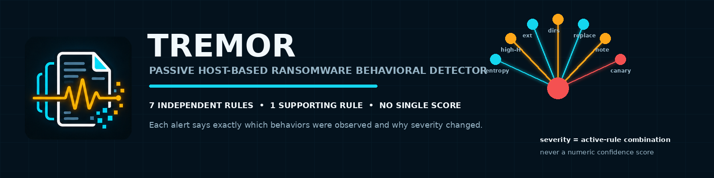
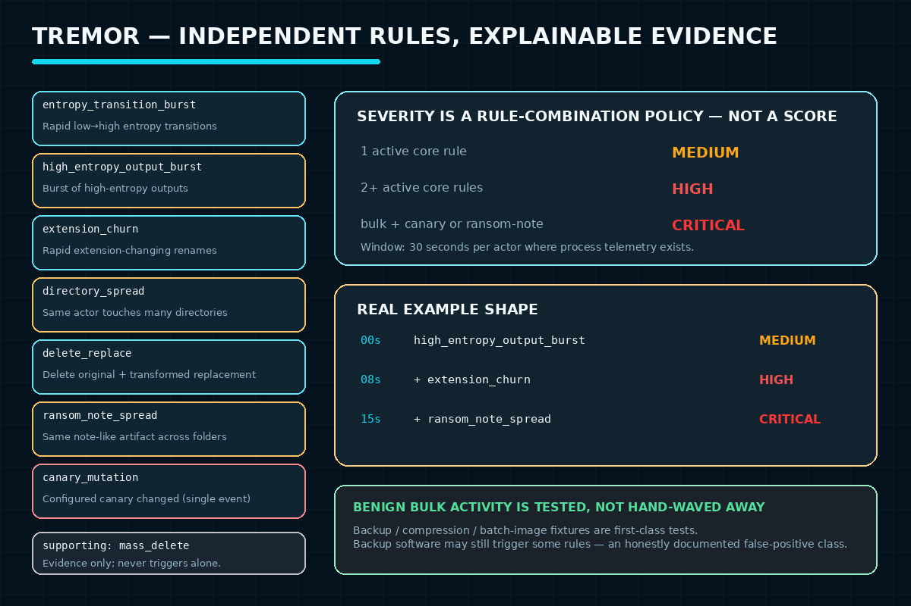

# Tremor — Ransomware Behavioral Detection Engine



*Ships as the `ransomwatch` CLI/library — see below.*


A passive, host-based behavioral detector for ransomware-like file
transformations. Analyzes live or replayed filesystem telemetry with
explainable, sliding-window rules -- entropy transitions, bulk renames,
extension churn, cross-directory spread, delete-and-replace sequences,
ransom-note-like artifacts, and decoy-file mutation -- while explicitly
modeling benign high-volume workloads (backup, compression, package
install, source-control cleanup, media processing) so it doesn't cry wolf
on them by default.

**This project performs no malware execution, encryption, or destructive
simulation anywhere.** See "Ethical Notice" below.

## Why this project exists

This replaces an earlier, partially-completed static malware-analysis
project in this workspace. Rather than another one-off "analyze this
binary" exercise, this builds a real, reusable detection tool grounded in
actual industry and academic prior art -- Objective-See's open-source
**RansomWhere?** detector and the **CryptoDrop**/**ShieldFS** research
lineage -- following the same "build a real, tested tool, not a report"
pattern used elsewhere in this workspace (see
[Squall](../squall/deauthguard/README.md),
the closest sibling in spirit: a passive behavioral detector for a
different attack class).

## Problem Statement

Most portfolio malware projects are static (hash a binary, match a
signature). Modern ransomware is frequently packed, polymorphic, or
fileless enough to evade that entirely. Real detection products
(Sophos CryptoGuard, Objective-See's RansomWhere?) instead watch *what
happens to files* -- rate, entropy, renames, spread -- rather than trying
to recognize the executable. This project builds an educational,
transparent version of that same principle.

## Objectives

- Detect ransomware-like file transformation from behavior, never from a
  single event, a bare entropy threshold, or a reason/signature match.
- Ground every default threshold in real, cited prior art, and label
  clearly which parts are that prior art vs. this project's own
  operational policy (no invented "industry standard" claims).
- Model real, documented false-positive classes (7-Zip, batch image
  processing, backup software) as first-class test fixtures, not an
  afterthought.
- Be honest about what the design cannot see: process-attribution gaps in
  portable telemetry, partial/intermittent encryption, entropy-evasion
  techniques, and per-process-only correlation.

## Tools and Technologies

Python 3.12, PyYAML, `watchdog` (optional, live monitoring only), pytest,
Ruff, GitHub Actions.

## Features

- Seven independent, explainable detection rules -- see "Detection rules"
  below -- each carrying its own evidence, never collapsed into one
  opaque score.
- Works identically against a live-monitored directory or a replayed
  JSONL event log (same detection engine; replay uses each event's own
  timestamp, never processing speed).
- Actor-aware correlation that degrades gracefully: when a telemetry
  source can't attribute events to a process (the portable default),
  correlation still works across one host-wide pool instead of silently
  failing or fabricating an identity.
- Alert coalescing (`detected` -> `updated` -> `recovered`), not one alert
  per matching event.
- 39 pytest tests, including dedicated **false-positive** fixtures and
  **evasion/limitation** fixtures that are expected NOT to fire -- both
  are first-class, not an afterthought.

## Detection rules

| Rule | Category | Fires when |
|---|---|---|
| `entropy_transition_burst` | core | >=5 distinct pre-existing files show an entropy increase >=0.1 bits/byte within 30s |
| `high_entropy_output_burst` | core | >=5 distinct files' output reaches >=7.95 bits/byte within 30s (works even for brand-new files with no "before") |
| `extension_churn` | core | >=10 pre-existing files renamed with a changed extension within 30s |
| `directory_spread` | core | >=8 distinct directories touched by one actor within 30s |
| `delete_replace` | core | >=5 distinct delete-original-then-rename-back sequences within 30s |
| `ransom_note_spread` | core | the same small (<=10KB) newly-created filename appears in >=3 distinct directories within 30s |
| `canary_mutation` | core | a configured decoy file is written, renamed, or deleted (single event, not rate-based) |
| `mass_delete` | supporting only | >=15 deletes within 30s -- recorded as evidence, never sufficient alone to raise an incident |

`window_seconds`/`transformed_files_threshold` mirror a real detector
(Objective-See's RansomWhere?, >=5 encrypted files/30s); every other
number is this project's own documented starting policy. See
`PROJECT.md` for exactly which value came from which source.

**Severity** is computed from which rules are jointly active, never a
numeric score: one core rule alone is `medium`; two or more (a "bulk
transformation") is `high`; a bulk transformation combined with
`canary_mutation` or `ransom_note_spread` is `critical`.

## Methodology

1. Research real behavioral-ransomware-detection prior art (RansomWhere?,
   CryptoDrop, ShieldFS, Sophos CryptoGuard, current MITRE ATT&CK T1486
   detection guidance) rather than inventing thresholds from scratch.
2. Design a normalized `FileEvent` model that never fabricates data it
   doesn't have (no `entropy_before=0` for a new file, no synthetic
   process identity when a source can't provide one).
3. Implement seven rules as independent, explainable functions over a
   per-actor sliding window, with alert coalescing so one long incident
   doesn't produce one alert per event.
4. Build a synthetic JSONL fixture generator (`tools/generate_event_fixtures.py`)
   covering benign workloads, suspicious patterns, AND documented evasions
   -- no real ransomware or destructive simulation anywhere.
5. Write tests that assert the detector stays silent on real documented
   false-positive classes (the 7-Zip case CryptoDrop's own researchers
   found; batch image processing) and correctly misses the evasions it's
   honestly not designed to catch (low-and-slow, partial encryption,
   entropy reshaping, multi-process splitting).

## How It Works



## Repository Structure

```text
ransomware-behavioral-detection/
  README.md, PROJECT.md, CHANGELOG.md, project.yaml
  ransomwatch/                    the detection engine
    README.md                    design writeup, rules table, limitations
    src/ransomwatch/              models, entropy, baseline, detector, cli, sources/
    config/default.yaml           research-inspired-v1 preset, documented per-value
    fixtures/                     benign/, suspicious/, evasions/ -- synthetic JSONL only
    tools/generate_event_fixtures.py   regenerates the fixtures
    tests/                        39 pytest tests
  .github/workflows/ransomwatch-ci.yml   lint + full offline pytest run
```

## Setup Instructions

```bash
cd ransomware-behavioral-detection/ransomwatch
python -m venv .venv && source .venv/bin/activate   # or .venv\Scripts\activate on Windows
pip install -e ".[dev]"
```

## Usage

```bash
cd ransomware-behavioral-detection/ransomwatch
ransomwatch analyze fixtures/suspicious/fast_transform.jsonl
ransomwatch analyze fixtures/benign/backup_borderline.jsonl --json
ransomwatch monitor ~/Documents --canary ~/Documents/.canary/decoy.docx  # requires: pip install -e ".[live]"
```

## How to Review

1. Start with this README, then [`ransomwatch/README.md`](ransomwatch/README.md)
   for the full design writeup and rules table.
2. Read [`PROJECT.md`](PROJECT.md) for the research grounding -- exactly
   which threshold came from RansomWhere? vs. CryptoDrop vs. this
   project's own policy, and the two real design corrections made before
   implementation (portable telemetry has no process attribution; entropy
   alone is not proof).
3. Run `cd ransomwatch && pytest -q` and try:
   `ransomwatch analyze fixtures/suspicious/fast_transform.jsonl` to see
   severity escalate from `medium` to `high` as a second independent rule
   joins, and `ransomwatch analyze fixtures/benign/backup_borderline.jsonl`
   to see the honestly-documented backup false positive.

## Results

39/39 pytest tests pass (offline, synthetic JSONL fixtures) and Ruff
reports zero issues. The suite includes 5 benign-workload fixtures (one
of which -- backup -- is *expected* to fire, documenting a real,
acknowledged false-positive class rather than hiding it), 4 suspicious
fixtures demonstrating each rule and the medium -> high -> critical
severity ladder, and 5 evasion fixtures that are *expected* to produce no
alert, each pinning down a specific, honest detection limitation.

## Limitations

- **Portable live telemetry has no process attribution.** `watchdog`
  (inotify on Linux) reports what changed, never who changed it.
  Correlation degrades to one host-wide pool in that mode; a Linux-only
  `fanotify`-based source with real PID/pidfd attribution is a documented
  future enhancement, not implemented here.
- **Partial/intermittent encryption can evade entropy sampling.**
  Sampling head/middle/tail (64 KiB each) instead of whole files is a
  real, documented cost/coverage tradeoff -- see
  `fixtures/evasions/partial_encryption_sampling_miss.jsonl`.
- **Entropy-reshaping evasion is a known, real technique** (see
  PROJECT.md reference [4]) -- entropy is one signal among several here,
  by design, and combined with no other behavioral change it is a
  genuine miss.
- **Low-and-slow evades any finite window** -- an attacker who stays
  under the rate threshold is not detected by this rule set; a longer
  sustained-window horizon is a documented future enhancement.
- **Per-actor correlation only** -- an attack deliberately split across
  multiple processes, each individually under threshold, is not
  aggregated into one host-wide campaign in v1.
- **This tool never determines intent.** Alerts say "ransomware-like
  file transformation," never "ransomware detected" or "malicious" --
  backup and compression software can legitimately trigger the same
  signals, and CryptoDrop's own authors explicitly acknowledge this
  can't be resolved from filesystem behavior alone.

## Future Enhancements

- A Linux `fanotify`/`FAN_REPORT_PIDFD` source for real process
  attribution in live mode.
- Multiple window horizons (a short burst window plus a longer sustained
  one) to catch low-and-slow campaigns without lowering the burst
  threshold.
- Cross-process/host-wide correlation for split-actor campaigns.
- Deriving canary-equivalent coverage automatically instead of requiring
  manual configuration.

## Safety and Privacy

- No real ransomware, encryption routine, destructive simulator, or
  malware sample exists anywhere in this repository. Every fixture is a
  hand-built JSON event record with explicit, synthetic values.
- Live monitoring only reads filesystem metadata and samples file
  content locally to compute entropy; it never transmits file contents
  anywhere.

## Ethical Notice

This project is a **detector only**. It performs no encryption, no
malware execution, no process manipulation, and no remediation. It
cannot be used to attack, encrypt, or damage anything -- it only observes
filesystem telemetry (live or replayed from a log) and reports patterns
consistent with published ransomware behavior research. Running it
against your own systems for defensive/educational purposes carries no
more risk than running any other filesystem-monitoring tool.
